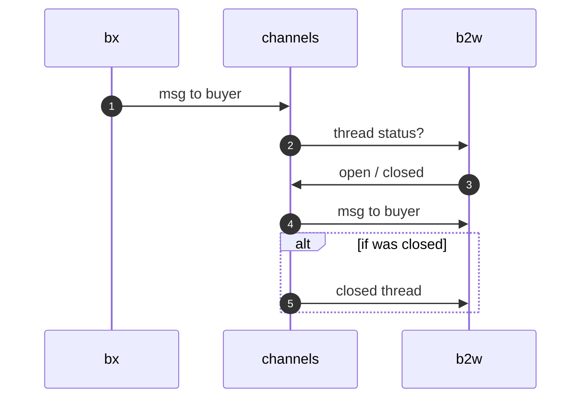

# h1

TODO

## h2

```mermaid
%%{init: {'sequence': {'showSequenceNumbers': true} }}%%
sequenceDiagram
  participant bx
  participant c as channels
  participant b2w

  bx->>c: msg to buyer
  c->>b2w: thread status?
  b2w->>c: open / closed

  c->>b2w: msg to buyer

  alt if was closed
    c->>b2w: closed thread
  end
```
